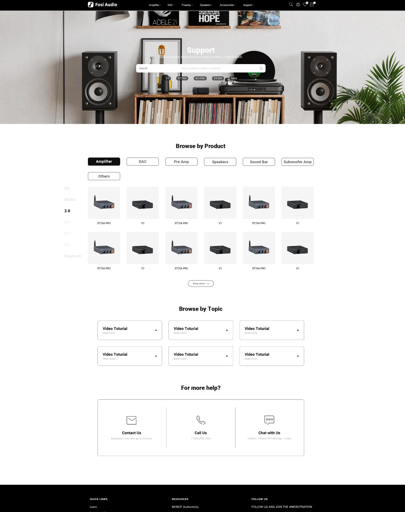
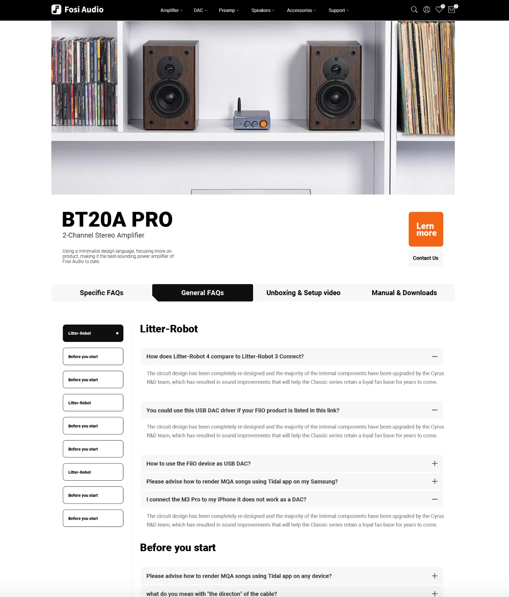

# Shopone CMS Template

Shopone theme template is a professional template for building product help centers, product manuals, operating instructions, video tutorials and FAQs.

template deployed by Baklib CMS.





## 🚀 Project Structure

```
  ├── README.md
  ├── config
  │   └── settings_schema.json
  ├── layout
  │   └── theme.liquid
  ├── package-lock.json
  ├── package.json
  ├── snippets
  │   ├── _breadcrumb.liquid
  │   ├── _collapse_pages.liquid
  │   ├── _feedback_form.liquid
  │   ├── _footer.liquid
  │   ├── _header.liquid
  │   ├── _hero.liquid
  │   ├── _page_sliders.liquid
  │   ├── _play_video.liquid
  │   ├── _related_pages.liquid
  │   ├── _sub_page_list.liquid
  │   └── _tag.liquid
  ├── statics
  │   ├── about.liquid
  │   └── sitemap.liquid
  ├── tailwind.config.js
  ├── templates
  │   ├── channel.liquid
  │   ├── channel.products.liquid
  │   ├── channel.videos.liquid
  │   ├── index.liquid
  │   ├── page.liquid
  │   ├── page.product.liquid
  │   ├── page.video.liquid
  │   ├── post.liquid
  │   ├── search.liquid
  │   └── tag.liquid
  └── yarn.lock
```


## 🧞 Install guide


- The Template install Guide: https://help.baklib.cn/

- The Baklib template install Guide: https://dev.baklib.cn/guide/git